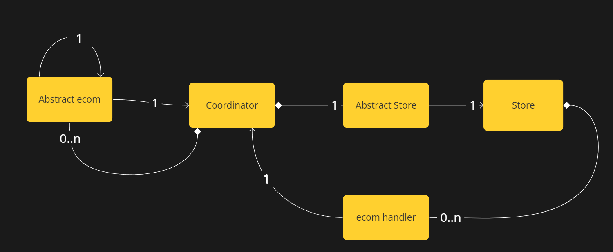
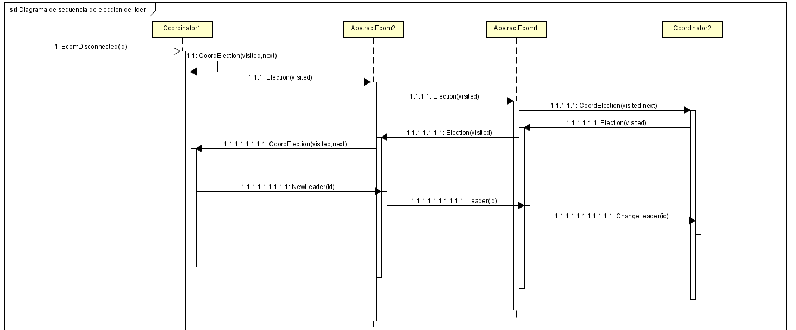

# Introduccion

En nuestro tp tenemos 2 tipos de procesos. El ecommerce y el store. Ambos procesos fueron implementados en su mayoria con funciones asincronicas, permitiendonos correr de manera concurrente diferentes tareas que no requieren de un uso execesivo de cpu. Ademas, se hizo uso del framework actix para generar un ecosistema de actores los cuales se comunican, y en conjunto, llevan a cabo la mayoria de las funcionalidades del sistema.

# Store

El store es el proceso que simula el funcionamiento de una tienda fisica. Desde este proceso, tenemos al actor Store, que es el encargado de crear actores `EcomHandler` por cada proceso ecommerce de la red que se conecte.

### Store

Este es el actor principal de este lado del programa. El actor `Store` es el encargado de manejar el stock y las comunicaciones con los diferentes ecommerce. Su stock esta en un *HashMap<String,ProductStock>*, en donde *ProductStock* es un struct que tiene los campos *available_quantity* y *reserved_quantity* los cuales le permiten teener tambien reservas por los pedidos onlines.
Otra de las cosas importantes que tiene el actor es el campo *leader*, el cual se ira actualizando cada vez que entre los ecommerce cambian de lider. Esto le permite saber al `Store` a quien comunicarle cada cambio de stock. 

### Ventas fisicas
De este lado, tenemos la funcion asincronica **receive_clients()**, que cada cierto tiempo aleatorio simula la llegada de un cliente fisico al local. Entonces le envia el mensaje **LocalProductOrder** al actor avisandole que se hizo un pedido fisico y con esto el actor puede modificar su stock. Al estar modificandose el stock desde el lado del store, el ecommerce es notificado para que tambien actualize el stock de su lado y tenga las cifras actualizadas.

### Ventas online
Luego para recibir las ordenes onlines desde el ecommerce, tenemos una task por cada ecommerce conocido de la red, cada una de estas corre la funcion asincronica **online_sales()**. Esta funcion, se conecta al ecommerce y crea una instancia del actor `EcomHandler` que se encargara de ser el puente entre los mensajes que llegan desde cada ecommerce con el actor `Store`.

Es el `EcomHandler` el que recibira los pedidos onlines y se los comunicara al `Store` para que los maneje. Cada vez que llegue un nuevo pedido online, se le mandara al actor `Store` un mensaje **ReserveProduct**, este pedido contiene el producto deseado, la cantidad de unidades de ese mismo producto y el tiempo que se espera que tarde en ser despachado. Una vez recibido, el actor reserva la cantidad pedida en su stock con un contador y le envia un mensaje a traves de un channel a otra de las funciones asincronicas que tenemos, **reserves_manager()**, la cual es la encaragada de decidir (de manera aleatoria) el tiempo que tardara en ser despachada la reserva del pedido online. Por cada reserva, genera una task la cual se le hace un sleep del tiempo que se tardara para despachar (simulando la preparacion del pedido) y si este es mayor a lo que el ecommerce habia decidido, se cancelara el pedido. Sea que se cancelo el pedido, o que se acepto, el ecommerce sera notificado.

### EcomHandler

Este actor nos permitio simplificar la comunicacion del `Store` con los ecommerce. En el principio teniamos task que escuchaban y el `Store` almacenaba todos los *WriteHalf<TcpStream>*. Pero esto nos trajo muchos problemas a la hora de mandar mensajes. 
Con la creacion de este nuevo actor, cada `EcomHandler` tiene asociado un stream. Entonces cada vez que le queramos mandar un mensaje desde el store a algun ecommerce, se lo enviariamos a este actor.

# Ecommerce

### Coordinator
En el proceso que simula el ecommerce es donde tenemos una mejor interaccion entre actores. Nuestro actor principal es el `Coordinator`. Este actor es crucial, ya que por cada store que se conecta, el `Coordinator` crea una nueva instancia del actor `AbstractStore`. Este actor tendra el stock actualizado de la store a la que este conectada. El coordinador tendra las direcciones de todas las AbstractStores que vaya creando, para poder comunicarles los pedidos que lleguen. Ademas, a la hora de conectarse a la red de ecommerce, por cada nueva conexion en la red, se crea una instancia del actor `AbstractEcom` los cuales se encargan de manejar el flujo de la conexion entre los diferentes ecommerce.

Por el lado de los pedidos, de manera aleatoria le llegaran al `Coordinator`, y este le preguntara a cada una de las `AbstractStore` si tienen stock del producto que se pide. Si ninguna tiene se perdera el pedido. Si alguna tiene, le avisara al `Coordinator` que ella puede manejar ese pedido.

### AbtsractStore
Este actor es, como dice su nombre, una abstraccion de las stores, pero del lado del ecommerce. Existe una instancia por cada conexion ecommerce-store. Tiene asociado un TcpStream desde el cual recibira respuestas de las tiendas fisicas y debera manejarlas dependiendo del contenido de dicha respuesta. Estos mensajes tienen efecto en el stock que conserva cada abstract store, el cual le permite al `Coordinator` decidir que store elegir para que maneje un pedido. Los mensajes que puede responder son los siguientes:
- STOCK: Es enviado por parte de las stores apenas empieza una conexion. Le avisa a la AbstractStore que un nuevo producto debe ser agregado al stock con cierta cantidad.
- APPROVED: Indica que desde el store, se aprobo el pedido online, y el AbtsractStore puede modificar su stock
- CANCELED: Al contrario que con el mensaje anterior, el pedido fue cancelado porque tardo mas de lo indicado en ser despachado

### AbstractEcom
Al igual que `AbstractStore`, con esta abstraccion asociada a una conexion TcpStream con otro proceso ecommerce, se nos simplifica la comunicacion entre ellos. Este actor sabe actuar sobre los siguientes mensajes:
- ORDER: Un pedido llega desde otro ecommerce que no es el lider, y entonces hay que pasarle ese pedido al coordinator para que se lo envie al `AbstractStore` correspondiente y este se lo envie al proceso store. 
- LEADER: Si llega este mensaje, es porque otro ecommerce ya eligio un nuevo lider y entonces hay que notificarle al coordinator para que cambie el lider.
- ELECTION: Este mensaje indica que otro ecommerce inicio el proceso de eleccion de nuevo lider, y que se debe seguir mandando este mensaje al siguiente del ring.

# Desconexion de stores

A la hora de desconectar tiendas, el proceso store puede recibir por terminal el comando para desconectarse de la red. Al desconectarse, mueren las conexiones entre esa tienda y los ecommerce, haciendo que del lado del ecommerce se detenga el actor `AbstractStore` correspondiente. Para volver a conectarse, el proceso tiene otro comando el cual ejecuta devuelta la conexion con todos los ecommerce de la red y estos de su lado crean devuelta el actor `AbstractStore`. El ecommerce lider es el que recibira el stock actualizado.

# Eleccion de lider

Para este proceso elegimos el algoritmo **Ring**. Cuando un proceso ecommerce se desconecta, la conexion de un `AbstarctEcom` se corta, y en ese momento se le avisa al coordinator que el lider murio y que se tiene que buscar un nuevo lider. Entonces le manda el mensaje *ELECTION* al siguiente ecommerce del ring, a traves de su correspondiente `AbstractEcom`. Cuando este le llega el mensaje *ELECTION* hace lo mismo, asi hasta que de la vuelta por el ring. Una vez que llega al que primero envio el mensaje, se elije el lider y se lo comunica a todas las `AbstractStore` y `AbstractEcom`.

